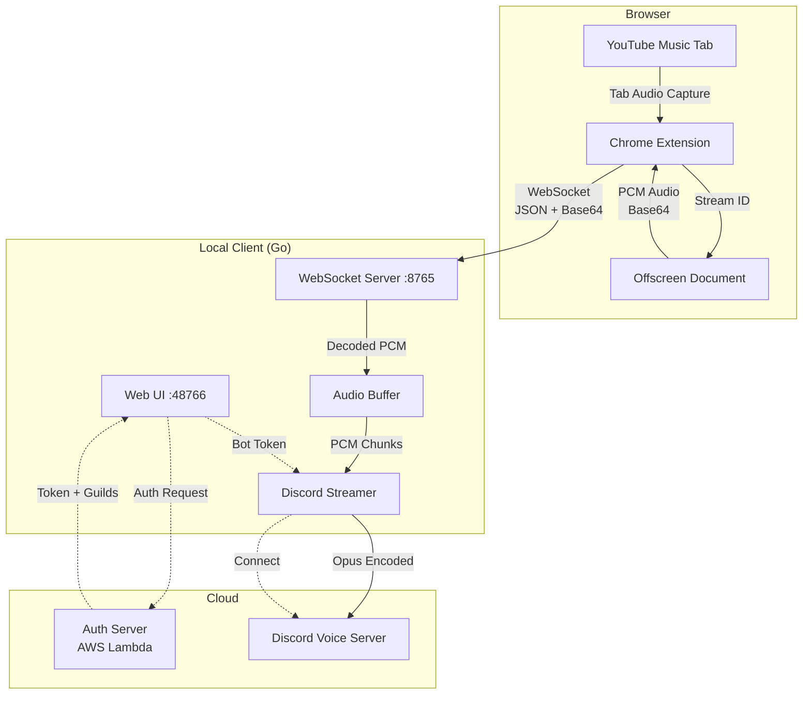
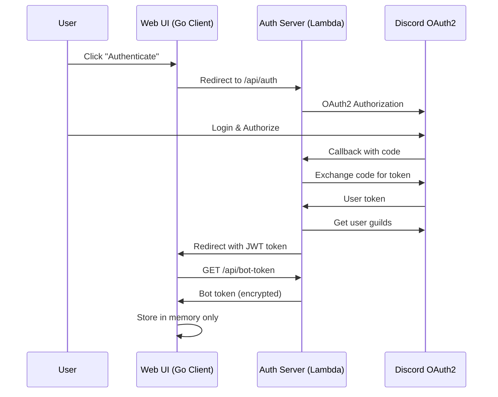
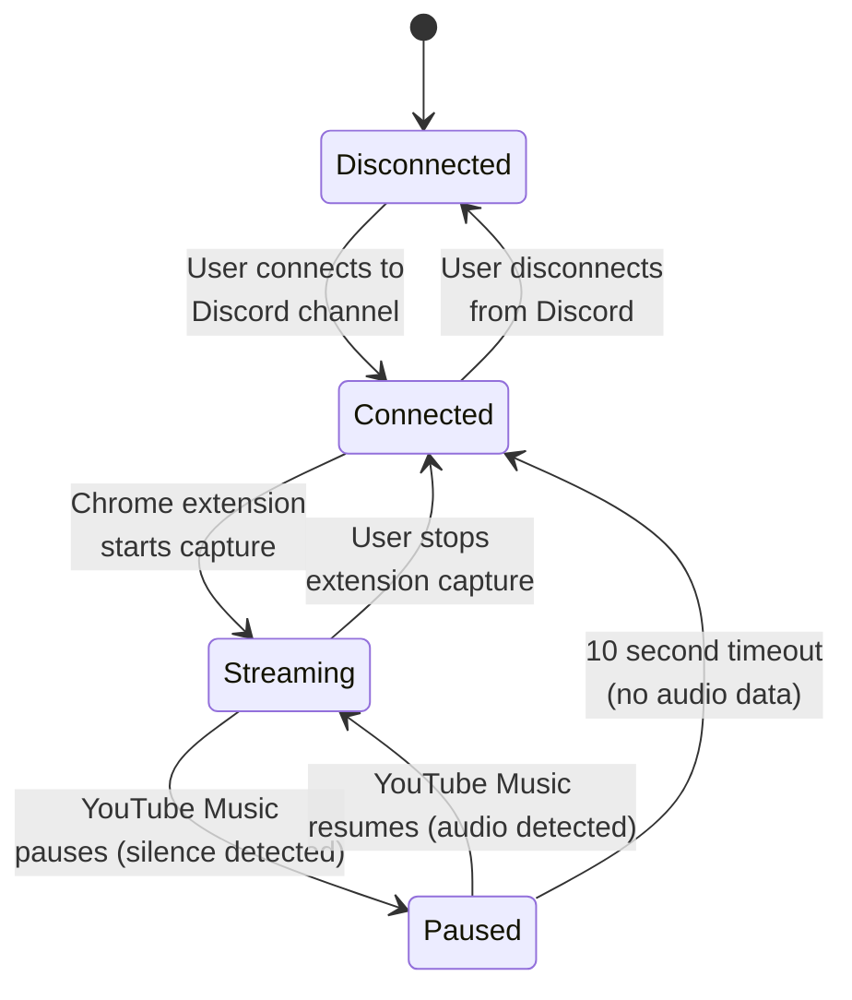
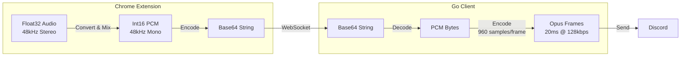
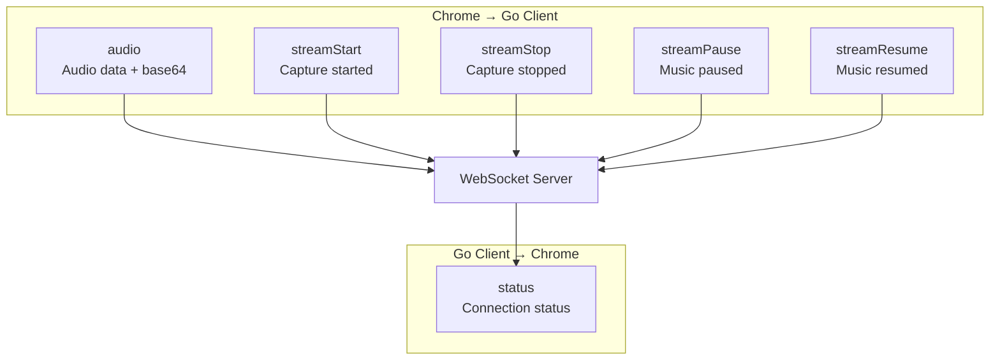
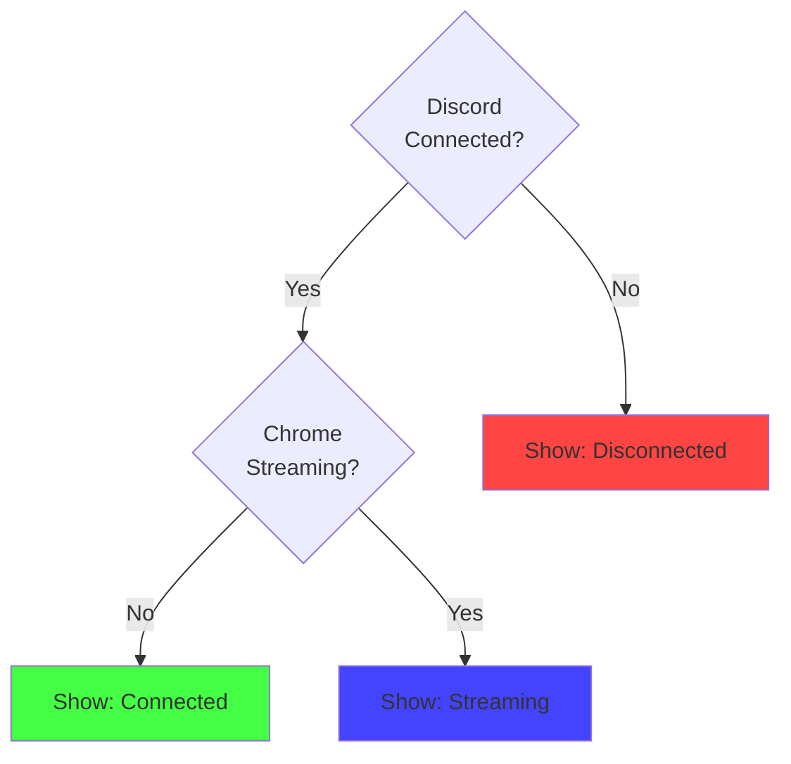
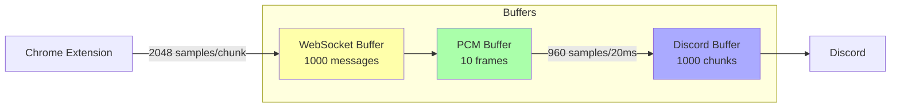
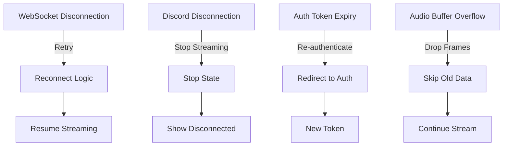

# trunecord (Music to Discord) Architecture

## Overview

This document describes the architecture and data flow of the trunecord system, which streams audio from YouTube Music to Discord voice channels.

## System Components

### 1. Chrome Extension
- Captures audio from YouTube Music tabs
- Sends audio data to local client via WebSocket
- Manages streaming state (play/pause)

### 2. Go Client (Local)
- WebSocket server (port 8765) - receives audio from Chrome extension
- Web UI server (port 48766) - user interface
- Discord audio streaming - sends audio to Discord voice channels

### 3. Auth Server (AWS Lambda)
- Handles Discord OAuth2 authentication
- Provides bot token to authenticated clients
- Returns available Discord servers/channels

## Audio Flow Diagram

## Authentication Flow

## Streaming State Management

## Data Format Flow

## WebSocket Message Types

## UI Status Display Logic

## Buffer Management

## Error Handling

## Component Responsibilities

### Chrome Extension (extension/)
- **background.js**: WebSocket connection, capture coordination
- **offscreen.js**: Audio processing, PCM conversion
- **content.js**: UI injection (Discord button)
- **popup.js**: Extension control panel

### Go Client (go-client/)
- **websocket/server.go**: Receives audio, tracks streaming state
- **discord/streamer.go**: Opus encoding, Discord voice connection
- **web/server.go**: Web UI, status API
- **auth/client.go**: Token management, API communication

### Auth Server (auth-server/)
- **lambda.js**: OAuth2 flow, JWT generation, bot token delivery
- Protected endpoints require valid JWT
- Bot token never stored client-side

## Key Design Decisions

1. **PCM Audio Format**: Simplified processing, compatible with Discord
2. **Base64 Transport**: WebSocket text frames, easier debugging
3. **Offscreen Document**: Chrome's requirement for audio capture
4. **20ms Frame Size**: Discord's optimal frame duration
5. **Silence Detection**: Accurate streaming state display
6. **Token Security**: Bot token fetched on-demand, stored in memory only
